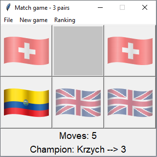
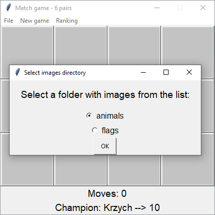
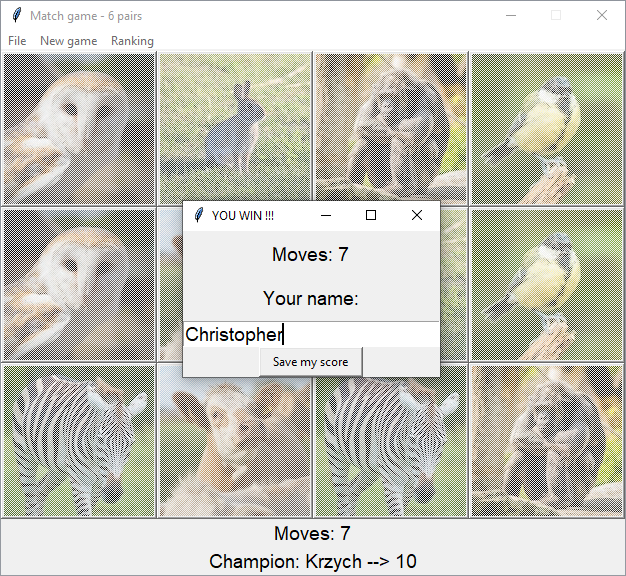

# Match game
Game also known as "memory game".
* The game consists of five levels: 3, 6, 10, 15 or 28 pairs.
* The player's task is to discover all the pairs in as few moves as possible.
* The ranking shows the top five scores in each level.
* Ability to add your own photos

### Table of contents
* [Introduction](#match-game)
* [Requirements](#required-libraries)
* [Default sets](#default-sets)
* [Add your image sets](#add-your-set-of-images)
* [Ranking](#ranking)

#### Required libraries:
* Pillow==9.4.0
* tk==0.1.0

#### Default sets:
* country flags
* animals

Graphics downloaded from [icons8](https://icons8.com) and [pexels](https://www.pexels.com/pl-pl/).

## Add your set of images
The program has a function to resize photos to the desired size. You can add your images to the game.
You must only select directory with images. The program automatically loads all photos with `jpg`, `jpeg` and `png` extensions and resizes them. 
Then you can change set in game option. 

### Ranking
Each level has own ranking. There are the best 5 players result. 

